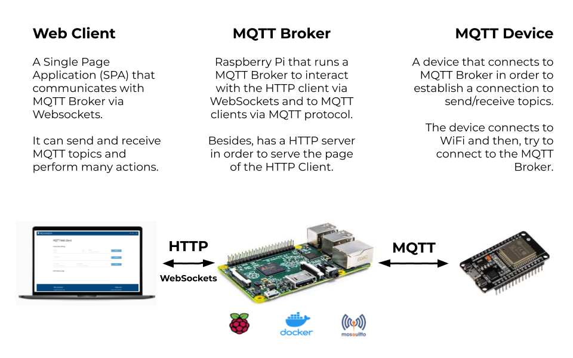

# Open source MQTT Platform

Author: Agustin Bassi - 2020

## 
## Table of Contents


* [Platform Introduction](#platform-introduction)
* [Install dependencies](#install-dependencies)
* [Run the application](#run-the-application)
* [Want to help?](#want-to-help-?)
* [License](#license)

## 
## Platform Description

The goal of this project is to create an open source MQTT Platform to be used as a part of an IoT system, based on MQTT protocol.

The platform consists in several modules described below. All of them are well described in the [Project Wiki](https://github.com/agustinBassi/mq-connection/wiki):

* **MQTT Broker**: Raspberry Pi that runs a MQTT Broker to interact with the HTTP client via WebSockets and to MQTT clients via MQTT protocol. Besides, has a HTTP server in order to serve the page of the HTTP Client.
* **MQTT Web Client**: A Single Page Application (SPA) that communicates with MQTT Broker via Websockets. It can send and receive MQTT topics and perform many actions. The code used for MQTT connection is based on [this project](https://github.com/jpmens/simple-mqtt-websocket-example).
* **Embedded MQTT Client**: A device that connects to MQTT Broker in order to establish a connection to send/receive topics. The device connects to WiFi and then, connects to the MQTT Broker. 

In the figure below there is a description of the platform modules and how they interact each others.



## 
## Install dependencies


The application runs over Raspberry Pi 3+. To install Raspberry Pi OS refer to [official documentation](https://www.raspberrypi.org/documentation/installation/installing-images/).

The platform needs the next dependencies.

* Docker & Docker-Compose (installation steps in [this link](https://devdojo.com/bobbyiliev/how-to-install-docker-and-docker-compose-on-raspberry-pi)).

_Although the application is designed to run on a Raspberry Pi 3+, it can runs on any system with Docker & Docker Compose installed. Docker installation steps in [official documentation](https://docs.docker.com/get-docker/). Docker-Compose installation steps in [official documentation](https://docs.docker.com/compose/install/)._

## 
## Run the application

Once dependencies are installed in the Raspberry Pi do the next steps.

1. Download the platform code (this repository) with the next command.

```
git clone https://github.com/agustinBassi/mq-connection.git
cd mq-connection/
```

2. Start the MQTT Broker and the HTTP server with the next command.

```
docker-compose up
```

3. Run the MQTT Web Client opening [http://raspberri_pi_ip:5001/](http://raspberri_pi_ip:5001/) in the web browser.

### Compile and upload mqtt-client-arduino

To run the `mqtt-client-arduino` it is necessary to have installed [PlatformIO](https://platformio.org/) in order to compile the project and upload the code into the board. In [this link](https://iot-es.herokuapp.com/post/details/17) there is a guide to install PlatformIO for Visual Studio Code, compile and run a project. More details in the [Project Wiki](https://github.com/agustinBassi/mq-connection/wiki).

Once PlatformIO is installed, set WiFi access and MQTT host IP address properly (the IP of the Raspberry Pi) in the file `mqtt-client-arduino/src/main.cpp` as follow (lines 48-52).

```c
// Wifi settings
const String WIFI_SSID   = "USER_WIFI_SSID";
const String WIFI_PASS   = "USER_WIFI_PASSWORD";
// Mqtt server settings
const String MQTT_SERVER = "MQTT_HOST_IP_ADDRESS";
```

Then, plug the embedded device via USB and run the command below to compile and upload the code into the board (Change `platformio` for `pio` if command fails).

```sh
platformio run --target upload
```

Finally, open a serial terminal with settings 115200-N-8 in the correct port to see `mqtt-client-arduino` running.

## 
## Want to help?

Pull requests are welcome. For major changes, please open an issue first to discuss what you would like to change.

If someone want to helpme, every bit of effort will be appreciated. In [this link](https://github.com/agustinBassi/mq-connection/projects/1) there is the project status board. You can take any card you want (or propose one) from the ToDo list and start to work.

If you find it useful please helpme following my Github user and give to this project a Star. This will animate me to continue contribuiting with the great open source community.

## 
## License

This project is licensed under the GPLV3 License.

