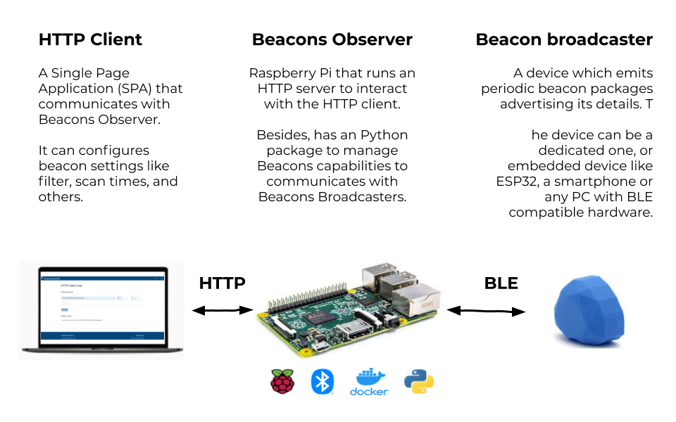

# Open source Bluetooth Beacons Platform

Author: Agustin Bassi - 2020

## 
## Table of Contents


* [Platform Introduction](#platform-introduction)
* [Install dependencies](#install-dependencies)
* [Run the application](#run-the-application)
* [Want to help?](#want-to-help-?)
* [License](#license)

## 
## Platform Description

The goal of this project is to create an open source Bluetooth LE Beacons Platform to be used as a part of an IoT system, based on beacons technology.

The platform consists in several sub-application described below:

* **Beacons Observer**: An HTTP REST API with beacon packages scanning features, which can reads different beacon types. By this module you can configure filters, scan time, turn on/off the beacon scanner, and get different beacon-related information like the nearest beacons, the list of beacon read, and many others.  
* **HTTP Client**: An HTTP Client that can executes different HTTP Request to Beacon Scanner API. There, the user can configure Beacon filters, scan time, turn on/off the scanner and other ones.  
* **Beacons Broadcasters**: A bunch of utilities for different platforms to generate beacon packages from devices like ESP32, Linux Systems or event any compatible smartphone.
* **Content Management System**: A CMS to associate each beacon to different content or action.

All of this parts are well described in the [Project Wiki](https://github.com/agustinBassi/blue-connection/wiki). Please, refer to it in order to get all required information.

In the figure below there is a description of the platform modules and how they interact each others.



## 
## Install dependencies


The application runs over Raspberry Pi 3+ (or Linux system based in Debian). To install Raspberry Pi OS refer to [official documentation](https://www.raspberrypi.org/documentation/installation/installing-images/).

The platform needs the next dependencies.

* Python 3.x (installation steps in [official documentation](https://python.org)).
* Docker (installation steps in [official documentation](https://docs.docker.com/get-docker/)).
* Docker-Compose (installation steps in [official documentation](https://docs.docker.com/compose/install/)).

## 
## Run the application

Once dependencies are installed in the Raspberry Pi do the next steps.

1. Download the platform code (this repository) with the next command.

```
git clone https://github.com/agustinBassi/blue-connection.git
cd blue-connection/
```

2. Compile the Beacons-Observer docker image with the command below.

```
docker-compose build beacons-observer
```

3. Start the Beacons-Observer and the HTTP Client with the next command.

```
docker-compose up
```

4. Run the HTTP Client. If the platform is running by managing the Raspberry Pi directly with mouse and keyboard go to [http://localhost:8000/](http://localhost:8000/) to open the client. If the platform is running by managing the Raspberry Pi via SSH go to [http://raspberri_pi_ip:8000/](http://raspberri_pi_ip:8000/) to open the client.

## 
## Want to help?

Pull requests are welcome. For major changes, please open an issue first to discuss what you would like to change.

If someone want to helpme, every bit of effort will be appreciated. In [this link](https://github.com/agustinBassi/blue-connection/projects/1) there is the project status board. You can take any card you want (or propose one) from the ToDo list and start to work.

If you find it useful please helpme following my Github user and give to this project a Star. This will animate me to continue contribuiting with the great open source community.

## 
## License

This project is licensed under the GPLV3 License.

